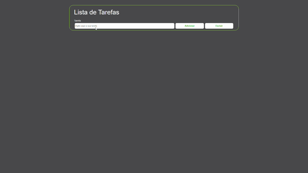

<h1 align="center"> :pushpin: Lista de Tarefas</h1>
<p align="center">Projeto de uma lista de tarefas utilizando Javascript, HTML e CSS.</p>

<p align="center">
  
  
  
  
</p>

Tabela de conteúdos
=================
<!--ts-->
   * [Sobre o projeto](#-sobre-o-projeto)
   * [Layout](#-layout)
   * [Como executar o projeto](#-como-executar-o-projeto)
     * [Pré-requisitos](#pré-requisitos)
     * [Rodando a aplicação](#rodando-a-aplicação)
   * [Tecnologias](#-tecnologias)
   * [Autor](#-autor)
   * [Licença](#-licença)
<!--te-->

## 💻 Sobre o Projeto

Esse é meu primeiro projeto, uma simples lista de tarefas utilizando html, css, javascripit vanilla, a biblioteca babel e o webpack.

## 🎨 Layout

Adicionando tarefas:

<p align="left">
  
</p>

Excluindo as tarefas:

<p align="left">
  
</p>

## 💿 Como executar o projeto

### Pré-requisitos

Primeriamente é preciso ter o [Git](https://git-scm.com) e o [Node.js](https://nodejs.org/en/) instalados em sua máquina, e algum editor de texto como o 
[VSCode](https://code.visualstudio.com/) para manusear o código. Durante o projeto utilizei o gerenciador de pacotes 
[Yarn](https://yarnpkg.com), caso queira utilizá-lo você precisa ter ele instalado, mas se preferir pode utilizar também o npm.

### Rodando a aplicação

Utilizando npm

```bash
# Clone este repositório
$ git clone https://github.com/leandrorossi/TodoList.git

# Acesse a pasta do projeto no terminal/cmd
$ cd TodoList

# Instale as dependências
$ npm install

# Execute a aplicação em modo de desenvolvimento
$ npm start

# O servidor inciará na porta:8080 - acesse http://localhost:8080
```

Utilizando yarn

```bash
# Clone este repositório
$ git clone https://github.com/leandrorossi/TodoList.git

# Acesse a pasta do projeto no terminal/cmd
$ cd TodoList

# Instale as dependências
$ yarn install

# Execute a aplicação em modo de desenvolvimento
$ yarn start

# O servidor inciará na porta:8080 - acesse http://localhost:8080
```

## 🧰 Tecnologias

As seguintes tecnologias foram usadas para a construção do projeto:

- **[HTML](https://developer.mozilla.org/pt-BR/docs/Web/HTML)**
- **[CSS](https://developer.mozilla.org/pt-BR/docs/Web/CSS)**
- **[JavaScript](https://developer.mozilla.org/pt-BR/docs/Web/JavaScript)**
- **[Babel](https://babeljs.io/)**
- **[Webpack](https://webpack.js.org/)**

## 👤 Autor


<b>Leandro U. Rossi</b>

 [](https://www.linkedin.com/in/leandro-rossi-4769ab1a6/)


## 📝 Licença

Esse projeto está sobe a licença [MIT](./LICENSE).
